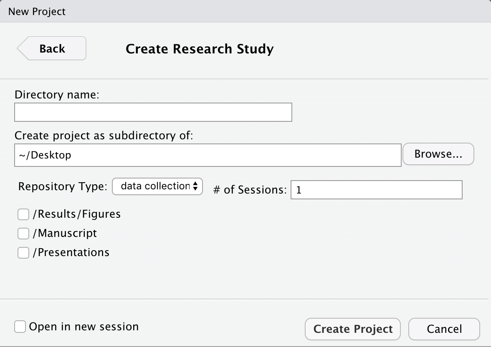
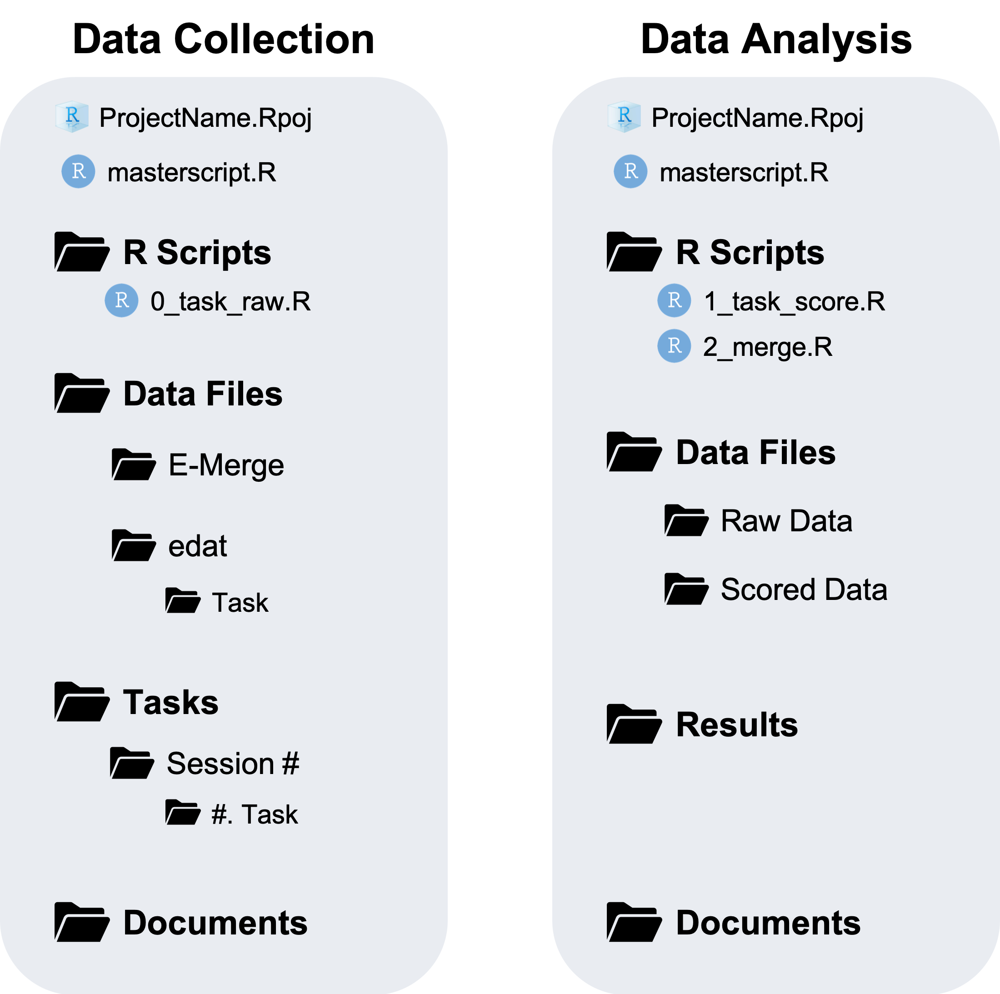

# workflow

A package to aid in the research workflow process

## Install

```r
devtools::install_github("dr-JT/workflow")
```

## Organization and Templates

As scientists we want to be able to focus on getting to the data, running statistical analyses to test hypotheses, creating visualizations, writing up a manuscript of our findings, and generating new theories. 

To do this, however, we have to organize our data and write code to do the analyses. We don't actually care about the organization or care about writing clean easy to read code. We might recognize that having good organization and clean easy to read code will make this whole process easier and has a lot of advantages, but it is also difficult and requires extra time. Therefore, these often times becomes an afterthought at best or at worst completely ignored.

For the most part, your workflow process from one research study to the next will require the same steps, processes, and organization. This means we should be able to automate this so we can spend more time on what we actually care about as scientists.

I have built this package with certain organization principles in mind. This way you can spend less time thinking about organization and writing clean easy to read code because these are already setup for you. You can have your cake and eat it too! 

Read about the organization principles this package uses

Read about how the generic script templates are setup

## Usage

### Setting up Data Repositories

One of the features of this package allows you to automatically setup the organization of a **Data Collection** or **Data Analysis** project.

Navigate to __File -> New Project... -> New Directory 

And browse until you see the option: __Research Study__

Click on that and you will see a dialogue box like this



Here are what the different options mean:

* __Directory Name__: This will be the name of the folder for the study

* __Create project as subdirecotry of__: Select Browse and choose where the folder (Directory Name) should be located.

* __Repository Type__: **data collection** or **data analysis**. Depending on which one you choose it will create the corresponding repository organization:

<div style="text-align: center">
  
</div>

* __# of Sessions__: How many sessions will the study have? This will create folders in the `Tasks` directory for each session. For instance, if there will be 4 sessions it will create the the folders "Session 1", "Session 2", "Session 3", and "Session 4". Obviously this is not needed for a **data analysis** repository.

* __Scripts__: Notice in the repository image above, how there are script files included. Yes, this will automatically create template scripts for you! Not just the directory structure.

    - masterscript.R: This will download 

    - Generic Scripts: This will download generic template scripts that you will find useful for new tasks. These scripts are explained in more detail in the next Chapter. Notice how if you choose the **data collection** repository it will only download a generic template for *converting "messy" raw data files to "tidy" raw data files*. And if you choose the **data analysis** repository it will download generic templates for *creating scored data files from "tidy" raw data files* and to *merge* the Scored data files into one final data file. 
    
    - Gf, WMC, and Attention Scripts: Because these are tasks that we commonly use you can download scripts for these tasks. These should be all good to go and require no modification. Unless you decide to use different data cleaning procedures. 
    
* __Other Directories__: I talked earlier about some other directories you may want to include in a **Data Analysis** repository. Well you can automatically add them here. 

Go ahead an play around with creating different types of repositories.

### Download R Script Templates

You can also add template scripts after the fact, if you already have a repository setup. 

```{r}
workflow::template(path = here::here(), masterscript = TRUE)
```

Or

```{r}
workflow::template(path = here::here(), generic = TRUE, type = "score")
```

Or

```{r}
workflow::template(path = here::here(), wmc = TRUE, type = "score")
```

To see all the different options use

```{r}
?workflow::template
```


